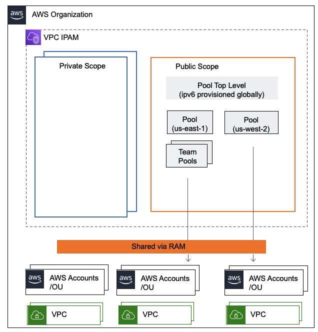

## IPv6 alongside IPv4

The example shows you how to build IPv6 as a second scope definition of the module. This can alternatively be a 2nd IPv4 Scope. The `basic_ipam` module builds the same IPAM setup from the [ipv4 example](../ipv4_basic/) and then uses the ipam default public scope output to load a byoip ipv6 range.

